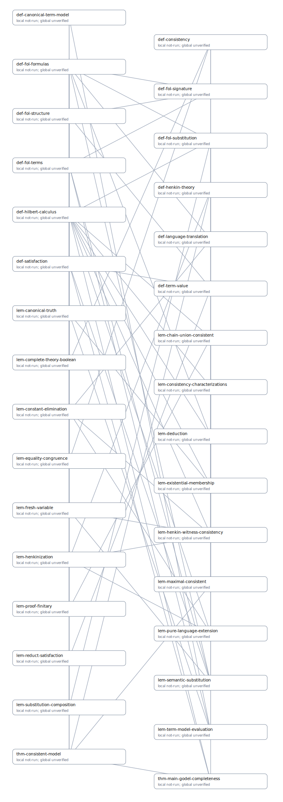

This page is generated by qmd-prover from protected main goals and retained workspace mathematics. Local verification is conditional on direct dependency statements; global status is computed from the complete dependency closure.

| Result | Local AI | Global | Refutation evidence | Source |
|---|---|---|---|---|
| — | — | — | — | — |

## Dependency graph

{fig-alt="A directed graph from results to the definitions and results cited by their proofs."}

## Diagnostics

- **error WORKSPACE_UNINITIALIZED** in `.qmd-prover/workspaces/thm-main-godel-completeness:?`: Goal-like directory @thm-main-godel-completeness contains active QMD files but has no workspace.json; run workspace init explicitly or move the files into an initialized workspace
- **error PARSE_ERROR** in `.qmd-prover/workspaces/thm-main-godel-completeness/calculus.qmd:?`: Pandoc is required to parse QMD. Install Pandoc or set QMD_PROVER_PANDOC (tried: pandoc).
- **error PARSE_ERROR** in `.qmd-prover/workspaces/thm-main-godel-completeness/foundations.qmd:?`: Pandoc is required to parse QMD. Install Pandoc or set QMD_PROVER_PANDOC (tried: pandoc).
- **error PARSE_ERROR** in `.qmd-prover/workspaces/thm-main-godel-completeness/henkin.qmd:?`: Pandoc is required to parse QMD. Install Pandoc or set QMD_PROVER_PANDOC (tried: pandoc).
- **error PARSE_ERROR** in `.qmd-prover/workspaces/thm-main-godel-completeness/main-proof.qmd:?`: Pandoc is required to parse QMD. Install Pandoc or set QMD_PROVER_PANDOC (tried: pandoc).
- **error PARSE_ERROR** in `.qmd-prover/workspaces/thm-main-godel-completeness/semantics.qmd:?`: Pandoc is required to parse QMD. Install Pandoc or set QMD_PROVER_PANDOC (tried: pandoc).
- **error PARSE_ERROR** in `completeness.qmd:?`: Pandoc is required to parse QMD. Install Pandoc or set QMD_PROVER_PANDOC (tried: pandoc).
